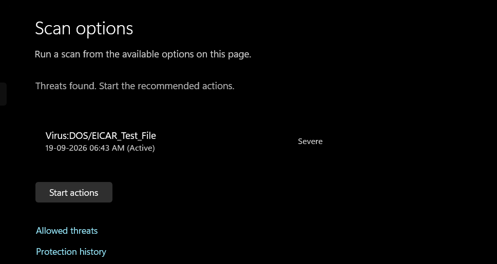
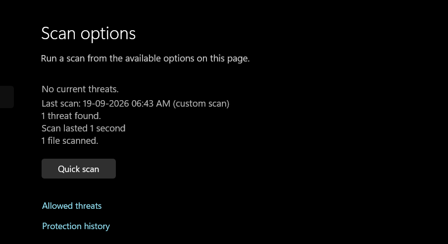
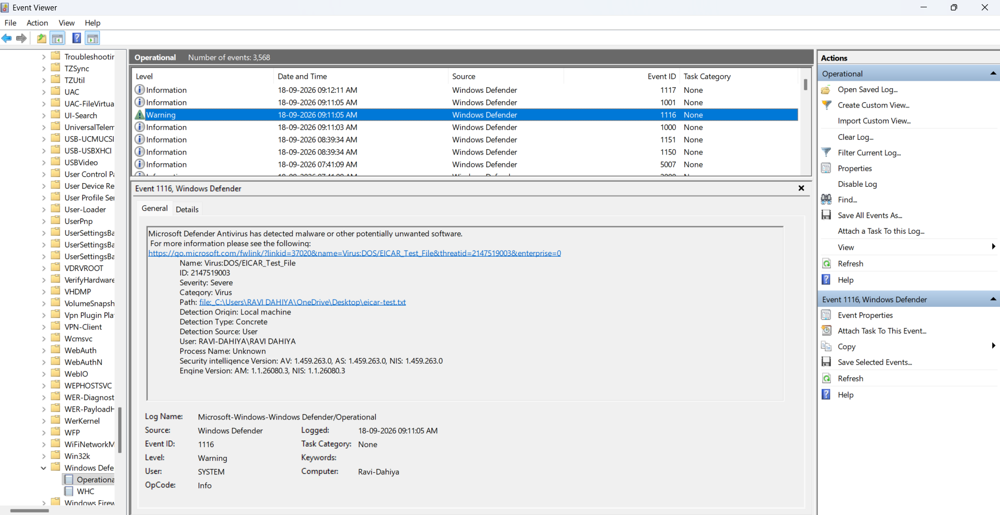
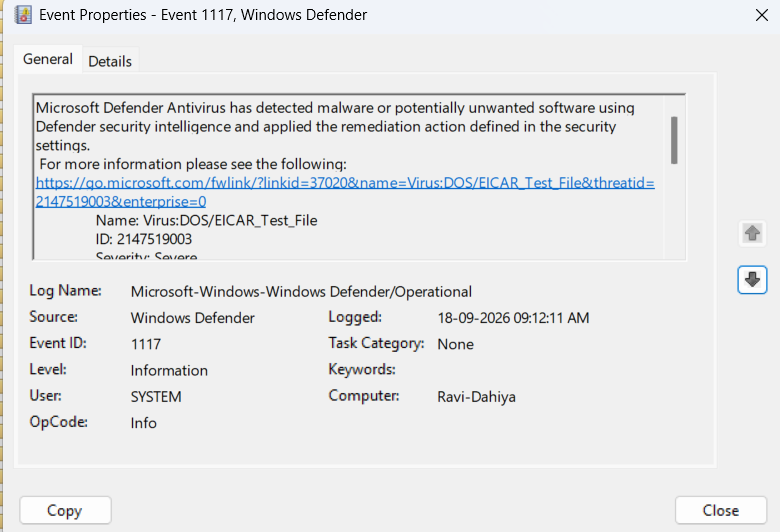
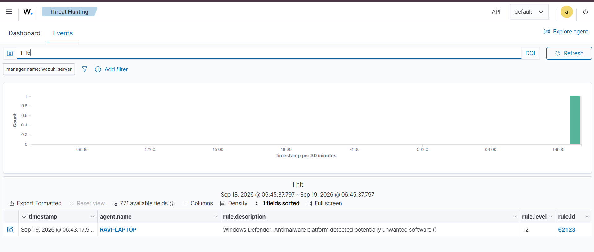

# Project 5: Defender Found Something — Triaging an Endpoint Security Alert

**Skills demonstrated:** Microsoft Defender, endpoint security, SIEM, Wazuh,
malware-alert triage, event correlation, documentation and escalation
**Environment:** Windows 11 (RAVI-LAPTOP), Microsoft Defender Antivirus, Wazuh
agent v4.14.7, Wazuh manager 4.14.7

## Objective

Bring together everything practiced so far: an endpoint generates activity, a
security product (Microsoft Defender) detects something, the SIEM (Wazuh)
collects the event, and an analyst investigates and decides what happens next.
The trigger used is the EICAR test file — a harmless, industry-standard string
that Microsoft Defender is designed to detect as if it were real malware,
without requiring any actual malicious code.

## Setup: Collecting Defender Events in Wazuh

By default, the Wazuh agent doesn't forward Windows Defender's event log. This
had to be configured explicitly before Defender's detections would be visible
in the SIEM.

1. Confirmed the source log first, in Event Viewer:
   `Applications and Services Logs > Microsoft > Windows > Windows Defender > Operational`
2. Edited the Wazuh agent config (`C:\Program Files (x86)\ossec-agent\ossec.conf`,
   opened as Administrator) and added inside `<ossec_config>`:
   ```xml
   <localfile>
     <location>Microsoft-Windows-Windows Defender/Operational</location>
     <log_format>eventchannel</log_format>
   </localfile>
   ```
3. Restarted the agent service: `Restart-Service -Name WazuhSvc`, confirmed
   `Running` via `Get-Service -Name WazuhSvc`.

**Troubleshooting note:** the first EICAR test was run *before* this
configuration change and agent restart. Wazuh only forwards events generated
*after* it starts monitoring a log source — it doesn't retroactively ingest
events that already existed in the Windows Event Log. The first detection
therefore appeared in Windows Security and Event Viewer but never reached
Wazuh. Re-running the EICAR test after the config change and restart resolved
this — a useful reminder that "no error in the config" doesn't mean "the data
is flowing," and that timing relative to when collection started matters.

## Generating the Detection

Following Microsoft's EICAR validation procedure, the standard EICAR test
string was saved into a `.txt` file on the desktop:

```
X5O!P%@AP[4\PZX54(P^)7CC)7}$EICAR-STANDARD-ANTIVIRUS-TEST-FILE!$H+H*
```

## Evidence

### 1. Microsoft Defender Detection



Defender flagged `Virus:DOS/EICAR_Test_File`, severity **Severe**.



After running the recommended action, Defender confirmed no current threats
remained: 1 threat found, 1 file scanned, scan completed in 1 second.

### 2. Windows Event Viewer — Defender Operational Log



**Event ID 1116** (detection):

| Field | Value |
|---|---|
| Threat Name | `Virus:DOS/EICAR_Test_File` |
| Severity | Severe |
| Category | Virus |
| Path | `C:\Users\RAVI DAHIYA\OneDrive\Desktop\eicar-test2.txt` |
| Detection Origin | Local machine |
| Detection Source | User |
| User | `RAVI-DAHIYA\RAVI DAHIYA` |



**Event ID 1117** (action taken):

| Field | Value |
|---|---|
| Action | **Quarantine** |
| Error Code | `0x00000000` (success) |
| Additional Actions | No additional actions required |

### 3. Wazuh — Correlated Detection



Search filter used: `1116`

| Field | Value |
|---|---|
| Agent | RAVI-LAPTOP (192.168.1.12) |
| Rule ID | 62123 |
| Rule description | Windows Defender: Antimalware platform detected potentially unwanted software |
| Rule level | **12** |
| Timestamp | 2026-09-19 06:43:17 |

Expanding the alert confirmed it carried the exact same underlying Windows
event data as seen directly in Event Viewer — `threat Name: Virus:DOS/EICAR_Test_File`,
the same file path, same user, same detection ID structure — proving the SIEM
captured the authentic Defender telemetry rather than a synthetic or
mismatched alert.

## Timeline

```
06:43:17  Defender detects EICAR string in eicar-test2.txt (Event 1116)
06:43:xx  Defender quarantines the file (Event 1117, Action: Quarantine)
06:43:17  Wazuh ingests the event via the Defender eventchannel,
          fires Rule 62123 (Level 12)
```

## Incident Record

| Field | Value |
|---|---|
| Alert source | Microsoft Defender / Wazuh (correlated) |
| Endpoint | RAVI-LAPTOP (192.168.1.12) |
| User | RAVI-DAHIYA\RAVI DAHIYA |
| Detection | EICAR test file (`Virus:DOS/EICAR_Test_File`) |
| File location | `C:\Users\RAVI DAHIYA\OneDrive\Desktop\eicar-test2.txt` |
| Security action | Quarantine (completed successfully, error code 0x00000000) |
| Additional evidence | Event Viewer Event ID 1116/1117; Wazuh Rule 62123, Level 12 |
| **Disposition** | **Authorized test activity — no escalation required** |
| Escalation | Not needed; EICAR is a known, industry-standard benign test signature and Defender's automated remediation completed without error |

**Case note:** Microsoft Defender detected and quarantined a file containing
the EICAR test string on RAVI-LAPTOP. The detection (Event ID 1116) and
remediation (Event ID 1117, Action: Quarantine, completed successfully) were
confirmed directly in Windows Event Viewer and independently corroborated in
Wazuh (Rule 62123, Level 12), which ingested the same underlying event data
via the Windows Defender eventchannel. No further action is required — this
was deliberately generated test activity using a recognized, harmless
signature, and the endpoint's automated controls functioned correctly end to
end.

## Optional: Tier 2 Handoff (if this had been escalated)

*Written as though the analyst had judged this worth a second look — for
practice, since the real disposition above is closure, not escalation.*

> **Summary:** Defender detected and quarantined a file on RAVI-LAPTOP
> matching the EICAR test signature. Automated remediation completed
> without error.
>
> **Why flagged for review:** [In a real case, this section would state the
> specific reason — e.g., unfamiliar file origin, unusual parent process, or
> a user account not expected to be creating files in that location.]
>
> **What's already been ruled out:** File origin confirmed as local user
> action (Detection Source: User); no network or lateral-movement indicators
> in this event; Defender's remediation reported full success with no
> partial-cleanup or repeated-detection follow-up needed.
>
> **What Tier 2 still needs to check:** Whether this file's creation
> correlates with any other activity on the host around the same timestamp
> (process creation, downloads, script execution) to rule out that the file
> was placed by something else on the system rather than a direct user action.

## Key Takeaway

This project tied together the full chain: an endpoint action, a security
product's detection and automated response, and a SIEM correlating that same
telemetry from a second, independent source. The most important lesson wasn't
technical analysis of the "malware" itself — EICAR is intentionally harmless —
but the workflow discipline: confirming where evidence originates, configuring
collection correctly, verifying the SIEM actually received the same event the
endpoint tool saw, and only then making a disposition call. The timing issue
encountered (config change after the first detection) is also a realistic
lesson: a working SIEM configuration with no errors doesn't guarantee
historical backfill, and verifying "did the event actually arrive" is itself
part of the job.
